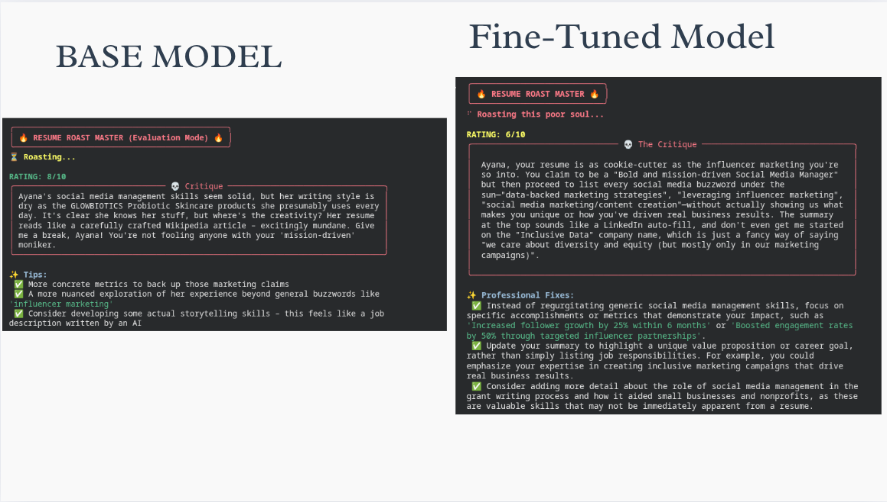
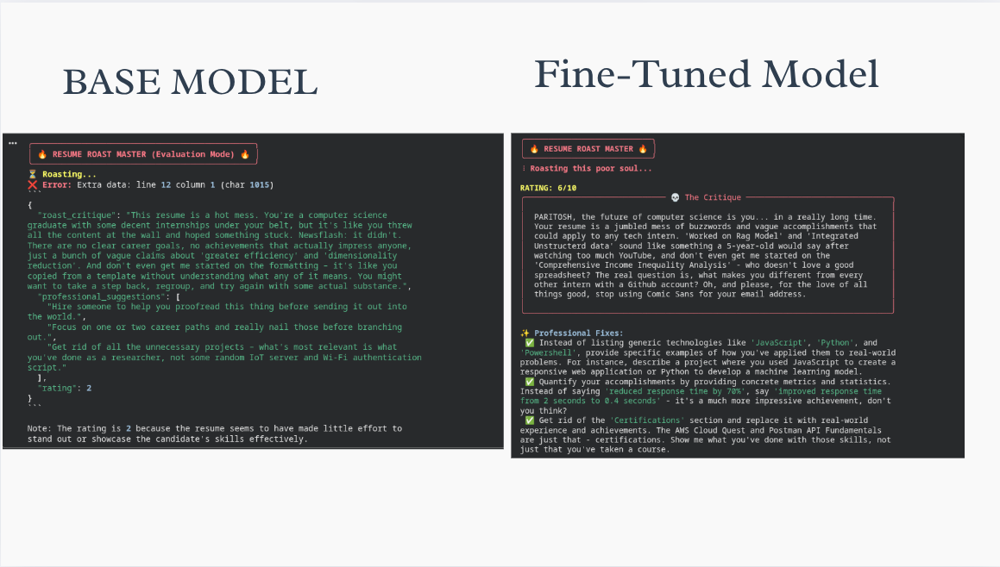
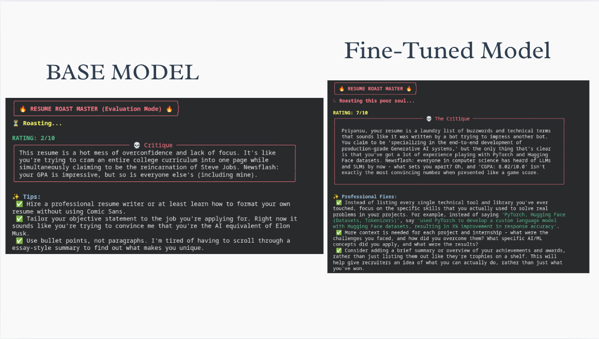

# 🔥 Resume Roaster AI

<p align="center">
  
</p>

We trained an SLM (Small Language Model) assistant for automatic resume critique — a Llama-3.2-3B parameter model that generates "Roast Mode" feedback and professional improvement suggestions.
Run it locally to keep your personal data private, or deploy it for instant feedback!


### **1. Install Dependencies**

First, install **[Ollama](http://ollama.com/)** from their official website.  
Then set up your Python environment:

```bash
# Create a virtual environment
python -m venv .venv
source .venv/bin/activate  # Windows: .venv\Scripts\activate

# Install required tools
pip install huggingface_hub ollama rich pymupdf
```
Available models hosted on HuggingFace:

- **[distil-labs/Distil-Rost-Resume-Llama-3.2-3B-Instruct](https://huggingface.co/distil-labs/Distil-Rost-Resume-Llama-3.2-3B-Instruct)**

### **2. Setup the Model**

Download your fine-tuned GGUF model and register it with Ollama.

```bash
hf download distil-labs/Distil-Rost-Resume-Llama-3.2-3B-Instruct --local-dir distil-model

cd distil-model
# Create the Ollama model from the Modelfile
ollama create roast_master -f Modelfile
```

### **3. Usage**

Now you can roast any resume PDF instantly from your terminal.

```bash
# Syntax: python roast.py <path_to_resume.pdf>
python roast.py my_resume.pdf
```

## ✨ Features

The assistant is trained to analyze resumes and output structured JSON containing:

- **💀 Roast Critique**  
  A sarcastic, humorous paragraph quoting specific problematic parts of the resume (typos, clichés, gaps).

- **✨ Professional Suggestions**  
  A list of **exactly 3** constructive, actionable tips to improve the resume.

- **📊 Rating**  
  An integer score **(1–10)** based on overall resume quality.

## 📊 Model Evaluation & Fine-Tuning Results

To validate the necessity of fine-tuning, we performed a strict **A/B Test** comparing the **Base Model** (Llama-3.2-3B-Instruct) against our **Fine-Tuned Student** (Llama-3.2-3B-Instruct).

### 1. The Engineering Challenge
We needed the model to satisfy three conflicting requirements simultaneously:
1.  **Strict JSON Schema:** Output *only* valid JSON (no Markdown wrappers like ` ```json `, no conversational filler).
2.  **Persona Shift:** Move from the base model's "Helpful Assistant" tone to a "Ruthless Roaster" persona.
3.  **Context Awareness:** Cite specific details from the resume rather than giving generic advice.

### 2. Quantitative Results 

| Metric | 🤖 Base Model (Llama-3.2-1B) | 👨‍🏫 Teacher Model (gpt-oss-120b) | 🔥 Fine-Tuned Student (Custom) |
| :--- | :--- | :--- | :--- |
| **JSON Valid Rate** | **70% (Failed)** | **100% (Passed)** | **100% (Passed)** <br>Matches Teacher performance. |
| **Persona Score** | **4/10 (Generic Snark)** <br>Often polite or apologetic. | **10/10 (Benchmark)** | **10/10 (Highly Contextual)** <br>Successfully mimicked the Teacher's tone. |
| **Hallucination** | **High** <br>(Invented formatting wrappers) | **None** | **None** <br>Strict adherence. |

> **Methodology:** A human evaluator reviewed outputs.

### **Evaluation Metrics**

| **Metric**         | **Teacher** | **Student-Base (Untrained)** | **Student-Tuned (Ours)** |
|--------------------|-------------------|-------------------------------|---------------------------|
| **ROUGE-L**        | 0.44              | 0.10                          | **0.43 ⬆** |
| **METEOR**         | 0.36              | 0.17                          | **0.35 ⬆** |


### 3. Qualitative Comparison (Side-by-Side)

We fed the same resume ("Paritosh") to both models.

#### ❌ Base Model Output (Failure)
* **Status:** **CRASH** (JSON Parsing Error)
* **Why:** The model "hallucinated" a conversational intro and added a disclaimer at the end, breaking the JSON parser.
```text
Here is the critique for the resume:
{
  "roast_critique": "The resume is okay but lacks specific details..."
}
Note: I tried to be critical but maintained a professional tone.
```
#### ✅ Fine-Tuned Model Output (Success)
**Status:** PASS (Valid JSON)

**Why:** The model output raw JSON immediately. The tone was specific to the user's *"Income Inequality"* project.
#### JSON
```json
{
  "roast_critique": "PARITOSH, the future of computer science is you... in a really long time. Your resume is a jumbled mess of buzzwords. 'Integrated Unstructured data' sounds like something a 5-year-old would say, and don't even get me started on the 'Income Inequality Analysis' - who doesn't love a good spreadsheet? Oh, and please stop using Comic Sans.",
  "professional_suggestions": [
    "Provide specific examples of real-world problems you solved instead of listing generic tech stacks.",
    "Quantify accomplishments. Instead of 'reduced response time', say 'improved response time from 2s to 0.4s'.",
    "Get rid of the 'Certifications' section and replace it with real project experience."
  ],
  "rating": 6
}
```

#### 🟦 Example 2
<p align="center">
  
</p>

---

#### 🟩 Example 3
<p align="center">
  
</p>

---

#### 🟥 Example 4
<p align="center">
  
</p>


### **Training Config**

- **Student:** Llama-3.2-3B-Instruct  
- **Teacher:** openai.gpt-oss-120b 
- **Dataset:** 10,000 synthetic examples

### 4. Conclusion

The fine-tuning process **successfully eliminated the formatting hallucinations** present in the base model and **significantly enhanced the "Roaster" persona**, making the outputs more structured, consistent, and aligned with the intended tone.


## ❓ FAQ

---

<details>
<summary><strong>Q: Why not just use ChatGPT or Claude?</strong></summary>

**Privacy and cost.**  
Resumes contain sensitive personal data (PII). Sending them to cloud APIs risks exposure.  
Our model runs **fully locally**, ensuring zero data leaks and costs **nothing** to run.
</details>

---

<details>
<summary><strong>Q: How accurate is a 3B model compared to GPT-4?</strong></summary>

Surprisingly good for this specific task!  
Because it’s fine-tuned on **6,000+ high-quality roast-style examples**, it performs far better than a generic prompt to GPT-4.  
It captures the **roast persona** more consistently and is extremely fast.
</details>

---

<details>
<summary><strong>Q: Can I use this for serious resume reviews?</strong></summary>

Yes!  
The **Professional Suggestions** section is trained on real career guidance data.  
You can ignore the roast and only use the actionable tips.
</details>

---

<details>
<summary><strong>Q: The model is too mean! Can I change it?</strong></summary>

The model is intentionally “brutally honest.”  
But since it outputs **structured JSON**, you can simply hide the `roast` field and show only the suggestions.
</details>

---

<details>
<summary><strong>Q: What hardware do I need?</strong></summary>

**Minimum:**  
- 8GB RAM (CPU Mode)  
- Works well on modern laptops (Mac M1/M2/M3 recommended)

**Recommended:**  
- NVIDIA GPU with **4GB+ VRAM** for 2–5s inference  
</details>

---

## 🤝 Community

Stay connected with Distil Labs and explore our ecosystem:

<p align="left">
  <a href="https://www.linkedin.com/company/distil-labs/">
    
  </a>

  <a href="https://www.distillabs.ai/">
    
  </a>

  <a href="https://huggingface.co/distil-labs">
    
  </a>

  <a href="https://www.distillabs.ai/contact">
    
  </a>

  <a href="https://distil-labs-community.slack.com/join/shared_invite/zt-36zqj87le-i3quWUn2bjErRq22xoE58g#/shared-invite/email">
    
  </a>
</p>


